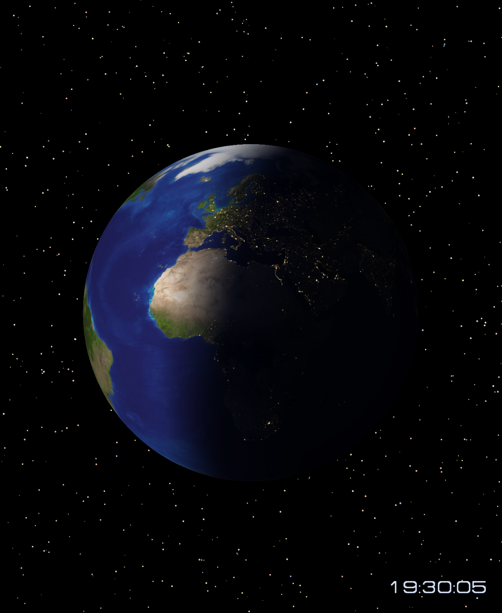

# World Clock (3D Wallpaper) for Omarchy

An animated 3D Wayland wallpaper with a rotating Earth, real-time daylight,
city flares, and local clocks around the world. The native OpenGL ES renderer
pauses when the desktop is covered, so it does not keep rendering behind an
opaque maximized or tiled workspace.

Inspired by the **Cities of Earth** screensaver from
[Screenomania](https://www.screenomania.com/).



Plugin ID: `spacexrace.worldclock`

## Install

```sh
omarchy plugin add https://github.com/spaceXrace/omarchy-world-clock.git --enable
```

## Requirements

World Clock builds its native renderer locally on first enable. It uses the
standard Omarchy development stack: a C compiler, Make, pkg-config, Wayland and
Wayland protocols, EGL/OpenGL ES, libpng, GLib, and Python 3. It does not
download code or data at runtime and does not request elevated privileges.

## Toggle and startup

Open the Omarchy menu and choose:

`Trigger` → `Toggle` → `World Clock Wallpaper`

The entry is added to the user extension file, so Omarchy updates do not
overwrite it. The check mark means the wallpaper is enabled. That enabled state
is stored by Omarchy itself: enabled starts automatically with the desktop;
disabled stays off across restarts.

Enabling the plugin explicitly authorizes it to add or refresh its clearly
marked `spacexrace.worldclock` block in
`~/.config/omarchy/extensions/omarchy-menu.jsonc`. It preserves the rest of the
file. Run the documented `uninstall-menu` command under **Remove** to delete
that block before removing the plugin.

The terminal equivalents are:

```sh
omarchy plugin disable spacexrace.worldclock
omarchy plugin enable spacexrace.worldclock
```

## Update

```sh
omarchy plugin update spacexrace.worldclock
```

The renderer rebuilds in the cache when its source changes.

## Remove

Remove the optional menu row first, then remove the plugin:

```sh
~/.config/omarchy/plugins/spacexrace.worldclock/bin/world-clock uninstall-menu
omarchy plugin remove spacexrace.worldclock
rm -rf -- "$HOME/.cache/spacexrace.worldclock"
```

The cache deletion is optional. Omarchy's plugin remover stops the service;
the existing static wallpaper is revealed immediately.

## Behavior

- Earth rotation period: 7.5 minutes
- Background star drift period: 5 minutes
- Default cap: 30 fps
- Coverage pause threshold: 95% of the target output
- Default output: the focused display at launch

The wallpaper never changes the current Omarchy theme, does not inhibit idle
or locking, and does not use the network at runtime. It currently targets one
display.

## Power usage

The 8K wallpaper was measured at 30 fps on a battery-powered Lenovo laptop with
an AMD integrated GPU and a 2560×1600 display. Three alternating one-minute
stopped/running pairs were recorded on an otherwise empty workspace; the first
10 seconds of each block were discarded for settling.

| Condition | Mean battery discharge | Whole-system CPU | Renderer CPU | GPU busy |
| --- | ---: | ---: | ---: | ---: |
| Wallpaper stopped | 6.75 W | 2.50% | 0% | 0% |
| 8K wallpaper visible, 30 fps | 7.97 W | 2.86% | 3.58% of one core | 10.29% |
| Difference | **+1.23 W** | +0.35 points | +3.58% of one core | +10.29 points |

The +1.23 W figure is a measurable whole-laptop increase while the desktop is
continuously visible, not a claim about isolated GPU power. The renderer pauses
when windows cover at least 95% of its display, so normal windowed work incurs
the cost only during the relatively short periods when the wallpaper can
actually be seen. As an illustration, if the desktop is visible for 10% of a
session, the measured visible-desktop difference corresponds to roughly 0.12 W
averaged over that session. That makes the practical impact negligible for
typical covered-desktop usage, though it will be higher for anyone who leaves
the desktop exposed for long periods.

The three paired increases were 1.213 W, 1.207 W, and 1.262 W. The retained
measurement summary is available in
[`measurements/8k-power-summary.json`](measurements/8k-power-summary.json).

## Development

```sh
make
./build/cities-earth --assets assets --preview
omarchy plugin validate .
```

## License

Code is MIT licensed. Third-party data and artwork retain their own terms; see
[ATTRIBUTION.md](ATTRIBUTION.md). In particular, the extracted bitmap fonts do
not have a confirmed redistribution license.
